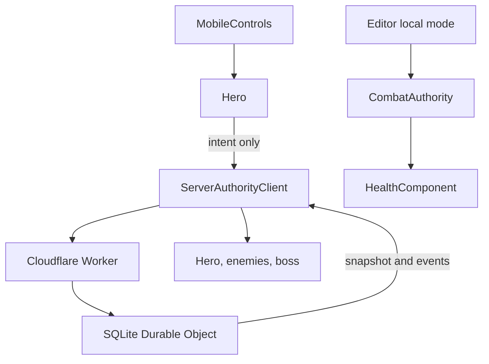

# Game architecture

> updated 2026-09-01 · 28cecf5

- `MobileControls` owns touch indices and emits one-shot actions; actors never inspect raw screen touches.
- In protected mobile exports, actors render server snapshots. They do not activate local damaging hitboxes, spend MP, grant rewards, load local saves, or run enemy combat AI.
- `ServerAuthorityClient` serializes one request at a time, resumes an opaque session, enforces sequence continuity, and locks gameplay on any connection/protocol failure.
- The Worker authenticates bearer tokens by hash and routes each opaque session ID to one SQLite-backed Durable Object.
- The deterministic server domain owns time, movement bounds, target selection, cooldown, mana cost, equipment allowlists, derived stats, damage, death, EXP, gold, and persistence.
- Editor-only local mode retains `Hitbox`, `Hurtbox`, `CombatAuthority`, `HealthComponent`, and checksummed saves for fast iteration and offline behavior tests.
- `PlayerProfile` recomputes derived stats from level and the weapon/armor catalog.
- `SaveRepository` owns only editor/local-debug persistence; protected exports never call it.
- `ReusablePool` owns projectile and damage-number reuse.
- `ZoneBuilder` owns the procedural TileSet, three TileMapLayer nodes, collision, hazard, and platforms.
