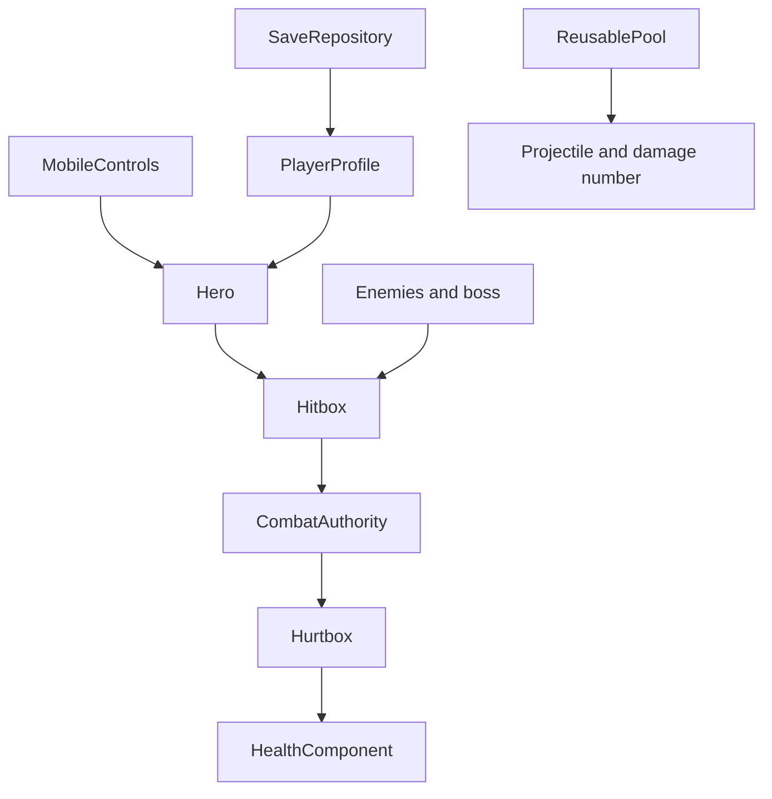

# Game architecture

> updated 2026-09-01 · c609b9e

- `MobileControls` owns touch indices and emits one-shot actions; actors never inspect raw screen touches.
- `Hero`, `EnemyController`, and `BossController` own movement and state transitions.
- `Hitbox` and `Hurtbox` only detect contact. `CombatAuthority` owns damage validation and resolution.
- `PlayerProfile` recomputes derived stats from level and the weapon/armor catalog.
- `SaveRepository` owns canonical serialization, checksum validation, and save-range validation.
- `ReusablePool` owns projectile and damage-number reuse.
- `ZoneBuilder` owns the procedural TileSet, three TileMapLayer nodes, collision, hazard, and platforms.

