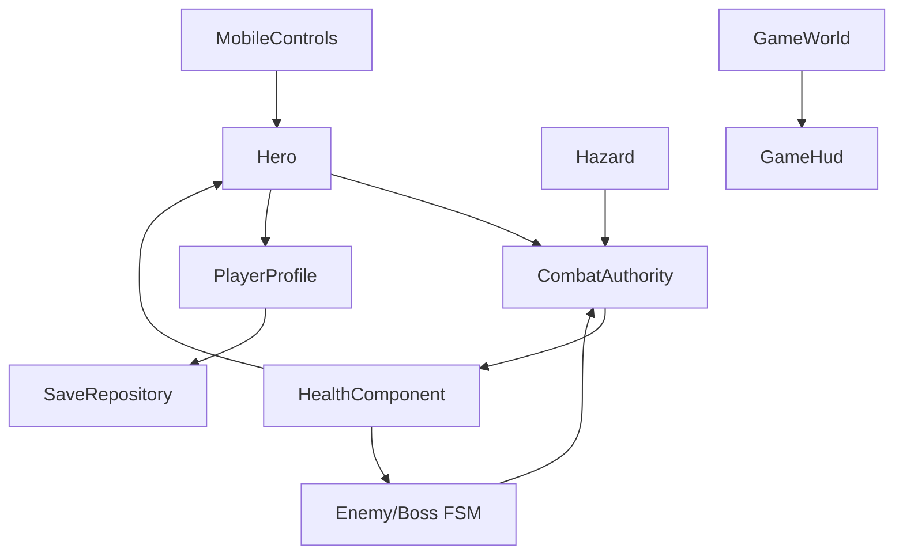

# Game architecture

> updated 2026-09-01 · 0.1.0

- One native Godot gameplay flow runs in editor, Android, and iOS; v1 has no gameplay network client or server runtime.
- `MobileControls` owns touch indices, safe-area positioning, one-shot actions, pause input, and lifecycle reset. Actors never inspect raw screen-touch ownership directly.
- `Hero` owns movement/jump/FSM/input consumption and delegates damage resolution to `CombatAuthority` through hitboxes/projectiles.
- `EnemyController` and `BossController` run their local FSMs on every platform; pause works by pausing the scene tree rather than maintaining a second simulation.
- `CombatAuthority` is the single canonical local damage boundary for melee, projectiles, enemy attacks, and hazards; `HealthComponent` applies canonical damage and i-frames.
- `PlayerProfile` recomputes derived stats from level and the weapon/armor catalog. Displayed ATK/DEF are never loaded directly from save data.
- `SaveRepository` owns local single-player persistence and validates schema, ranges, equipment IDs, canonical stat limits, and checksum before restoring progress.
- `ReusablePool` owns projectile and damage-number reuse; `PerformanceBudget` keeps the v1 draw-call budget visible.
- `ZoneBuilder` owns the procedural TileSet, three TileMapLayer nodes, collision, hazard, and one-way platforms.
- `GameHud` and `MobileControls` map platform safe-area pixels into the stretched Godot viewport so notch/cutout/gesture insets do not own interactive controls.
